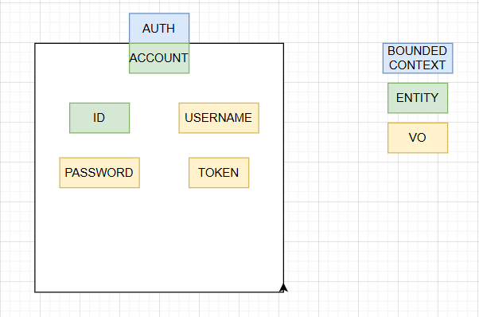
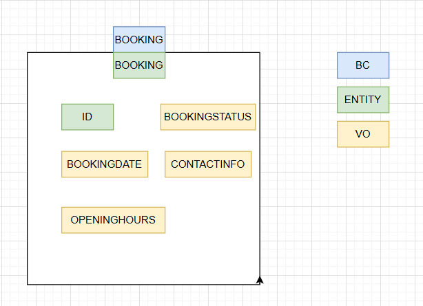
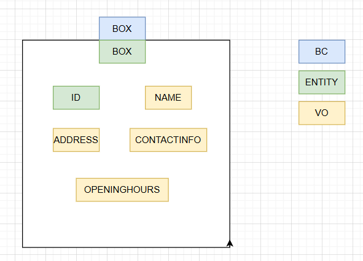
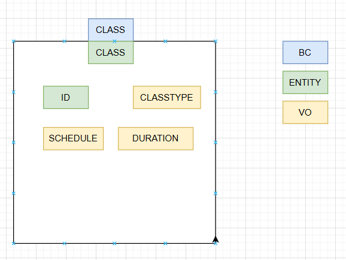
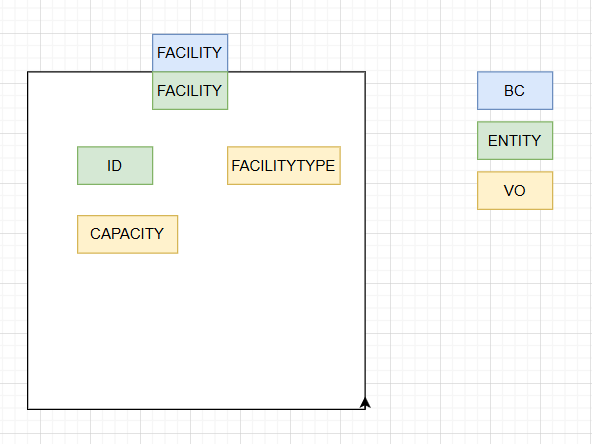
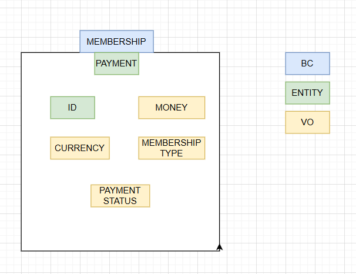
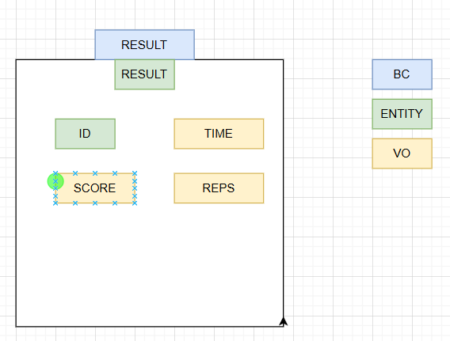
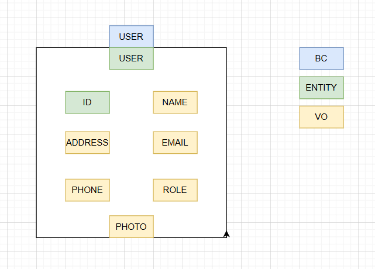
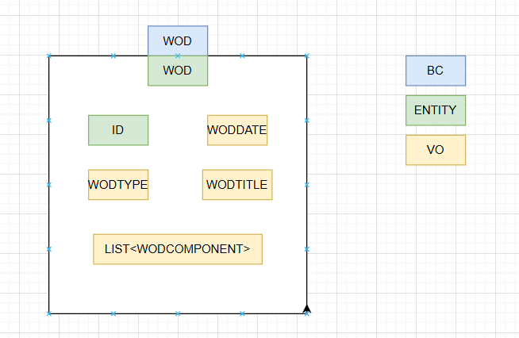
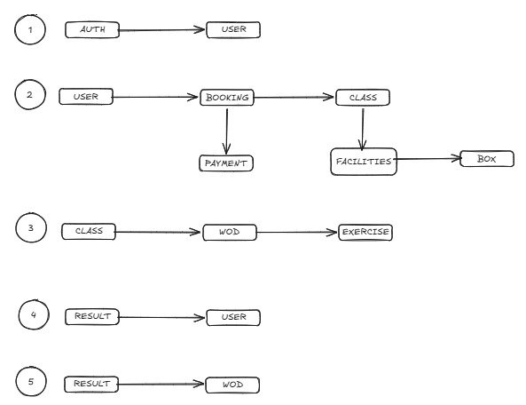

# BoxCommunity App
**Goal**: The all-in-one platform for managing your CrossFit box and tracking athlete performance.

## **Mainly Features**
*For athletes:*
* Class Management
    - Manual and automatic ClassSession booking.
    - Waiting list.
    - View capacity in real time.

* Training and WODs
    - WOD calendar.
    - Scheduled training sessions.
    - Automatic training volumen adjustements.

* Personal tracking
    -  Personal records (PRs).
    -  Historic PRs.

* Integratiosn
    - Smartwatches.
    - Strava.
    - Apple.

*For coaches:*

* Scheduling
    - WODs and events creation.
    - Information and tips for training.

* Box Management
    - Administrator.
    - Attendance monitoring.
    - Personal chats with user.
    - Payments.

## **Installation Instructions**

## **User Manual**

## **Software Design**
In order to create a scalable, legible and achieve a clean architecture I decided to use DDD. 

Its mains steps are: 

### *Creating bounded contexts (BC)*
It means creating a unique objects or entities that represent the core of our domain. In our case we count with the following:
1. 
2. 
3. 
4. 
5. 
6. 
7. 
8. 
9. 

At the same time, each BC contains some Value Objects (VO) which are immutable and help with encapsulation.

### *Context Relationships (BC)*
The way of bounded context relation between them. 
1. 

### *1st version* ###
This application uses a hexagonal architecture and vertical slicing allowing each functionality will be autonomous. I chose this design because it helps to reduce innecessary code and simplify project management.
First version structure correspond to vertical slicing:
1. Auth
2. Booking
3. Box
4. Class
5. Exercise
6. Facility
7. Membership
8. Result
9. User
10. Wod

Furthermore, each folder contains another set of folders which correspond to hexagonal architecture:
1. Application
2. Domain
3. Infrastructure

## **Technologies Used**

*Management*
1. Jira

*Backend*
1. Java 17
2. SpringBoot dependencies:
    - Spring Web
    - Spring JPA
    - Spring DevTools
    - Srping Data JPA
    - Sorung Security
    - Lombok

*Frontend*
1. JS
2. HTML5
3. CSS3
4. TypeScript
5. React

*Database*
1. PostgreSQL

*Documentation*
1. Swagger/OpenApi
2. Confluence
3. JavaDoc

*DevOps*
1. CI/CD
2. Docker
3. AWS

